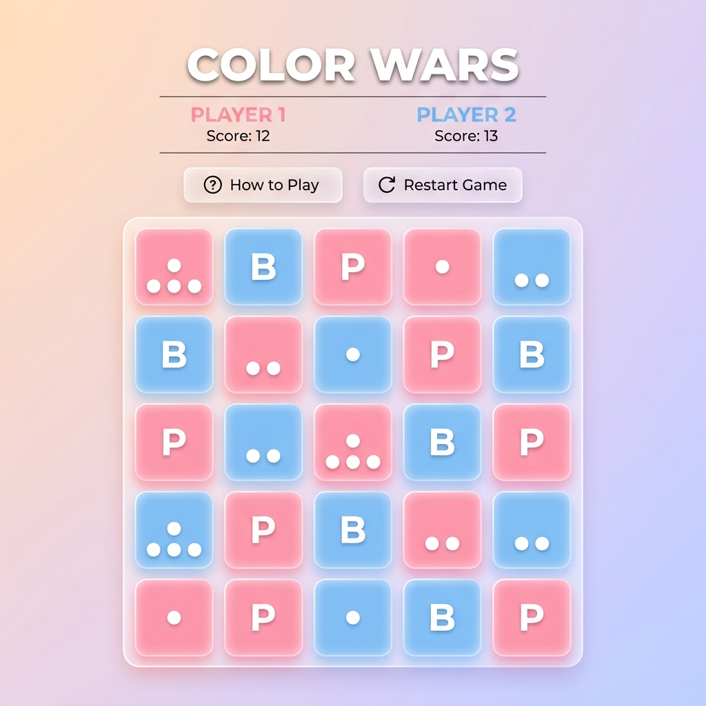

# Color Wars

Color Wars is a dynamic, highly-animated web-based strategy puzzle game inspired by the classic game Chain Reaction. It features stunning cinematic visuals, micro-animations, glowing neon aesthetics, and real-time online multiplayer gameplay!

## Features
- **Local PvP (Player vs Player):** Play with a friend on the same device.
- **Local PvC (Player vs Computer):** Challenge the Minimax-powered AI.
- **Online Multiplayer:** Create private game rooms with a unique 6-character code and invite friends to play over the internet in real-time.
- **Cinematic Dark Space Theme:** Highly immersive UI with glowing borders, particle explosions, and smooth CSS transitions.

## How to Play
1. Players take turns placing a dot in an empty cell or their own cell.
2. A cell explodes when its dots equal its number of neighbors (Corners = 2, Edges = 3, Center = 4).
3. Exploding cells shoot dots to adjacent cells, converting them to your color!
4. The chain reactions can be massive!
5. You win when you completely wipe out the opponent's color from the board.

## Architecture Design
The project uses a decoupled Full-Stack architecture separating the client from the server, allowing for robust, independent deployments.

### Frontend
- **Tech Stack:** Pure HTML, CSS (Vanilla), and JavaScript.
- **Role:** Handles the UI, rendering animations, managing Local gameplay logic, and communicating with the backend via WebSockets.

### Backend
- **Tech Stack:** Node.js, Express, Socket.io, and Mongoose (MongoDB).
- **Role:** A pure API / WebSocket server. It maintains the authoritative game state for online matches, preventing cheating and desynchronization.
- **Database:** MongoDB Atlas is used to persistently store active game rooms and their current board states.
- **Event-driven Logic:** Utilizes Socket.io for instantaneous, bidirectional communication. Client "move" events are validated against the backend game rules, and resulting chain reactions are calculated server-side before broadcasting the new state back to the connected clients.

## Deployment Strategy
Because the frontend and backend are completely decoupled, they can be deployed independently for optimal performance:
- **Backend (`/backend`):** Deployed as a Node Web Service (e.g., on Render or Heroku) with a connected MongoDB Atlas database.
- **Frontend (`/frontend`):** Deployed as a fast static site (e.g., on Vercel or Netlify) pointing to the live backend URL via the `BACKEND_URL` variable.

## Screenshot

